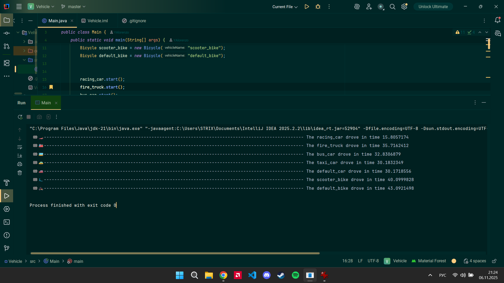

# 🚗 Vehicle Simulation (Java)

A small console simulation that animates different vehicles moving across the terminal.  
Each car or bicycle travels from left to right, accelerates, brakes, and prints how long it took to finish the track.

---

## 📌 Description

This project demonstrates core OOP concepts in Java:

- interfaces  
- enums  
- inheritance  
- simple console animation  
- time measurement using `System.nanoTime()`  

Every vehicle moves along a road of **100 units**, visually represented with emojis.

---

## ✅ Vehicles Included

### 🚗 Cars
- 🚒 fire_truck  
- 🏎️ racing_car  
- 🚌 bus_car  
- 🚕 taxi_car  
- 🚗 default_car  

### 🚴 Bicycles
- 🚲 default_bike  
- 🛴 scooter_bike  

Each vehicle has:
- its own emoji model  
- initial speed  
- acceleration and braking points during the run  

---

## 📤 Example Output

